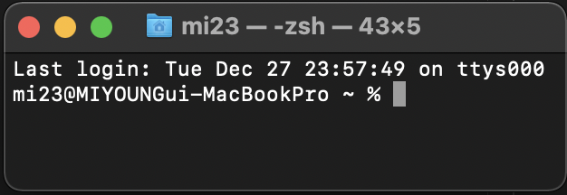

###
## Git/GitHub
 - 버전관리
 - Git : 로컬저장소, GitHub : 원격저장소 
 - [Markdown](markdown.md)을 활용한 문서 작성
 - GitHub Pull Request 기반 협업
 
## CLI
 - 명령 기반의 인터페이스
 - 프롬프트 기본 인터페이스
    1. 컴퓨터 정보
    2. 디렉토리
    3. ~(홈디렉토리)
    4. $(%)
 
- 기초파일 시스템 명령어
    - pwd : 현재 디렉토리 출력
    - cd : 디렉토리 이동
        - . : 현재 디렉토리
        - .. : 상위 디렉토리
    - ls : 목록
    - mkdir : 디렉토리 생성
    - touch : 파일 생성
    - rm : 파일 삭제
    - rm -r : 폴더 삭제하기