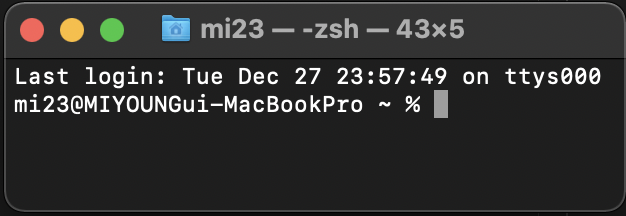

# [1주차 Git 기초](https://github.com/qloeo/til.git)

## CLI
 - 명령 기반의 인터페이스
 - 프롬프트 기본 인터페이스
    1. 컴퓨터 정보
    2. 디렉토리
    3. ~(홈디렉토리)
    4. $(%)
 
- 기초파일 시스템 명령어
    - pwd : 현재 디렉토리 출력
    - cd : 디렉토리 이동
        - . : 현재 디렉토리
        - .. : 상위 디렉토리
    - ls : 목록
    - mkdir : 디렉토리 생성
    - touch : 파일 생성
    - rm : 파일 삭제
    - rm -r : 폴더 삭제하기

## Git/GitHub
- 버전관리
- Git : 로컬저장소, GitHub : 원격저장소 
- [Markdown](markdown.md)을 활용한 문서 작성
- GitHub Pull Request 기반 협업

### Git
    1. 분산 버전관리
        - 로컬 편집> 중앙서버에서 버전 관리
        - 로컬에서도 버전 관리 > 원격 저장소 활용 협업

    2. 버전관리 기초 흐름
        - 저장소 생성(init). 작업하고 변경된 파일을 모아, 버전으로 남겨 관리
        - modified : 수정된 상태
        - staged : 수정한 파일을 곧 커밋할 것이라고 표시한 상태
        - committed : 커밋이 된 상태

    3. 명령어
| 명령어 | 내용 |
|------|-----|
| git init| 로컬 저장소 생성 |
| git add <파일명> | 특정 파일/폴더의 변경사항 추가 |
| commit -m'커밋메세지' | 상태확인 |
| git log | 버전 확인 |
| git status | 상태확인 |

    4. 필수 정보 설정
        - git config --global user.name "username"
        - git config --global user.email "my@email.com"
        - 설정 확인
            - git config -l
            - git config --global -l
            - git config user.name
        - Git Config?
            1. --system 
                - /etc/gitconfig
                - 시스템의 모든 사용자와 모든 저장소에 적용(관리자 권한)
            2. --global
                - ~/.gitconfig
                - 현재 사용자에게 적용되는 설정
            3. --local
                - .git/config
                - 특정 저장소에만 적용되는 설정